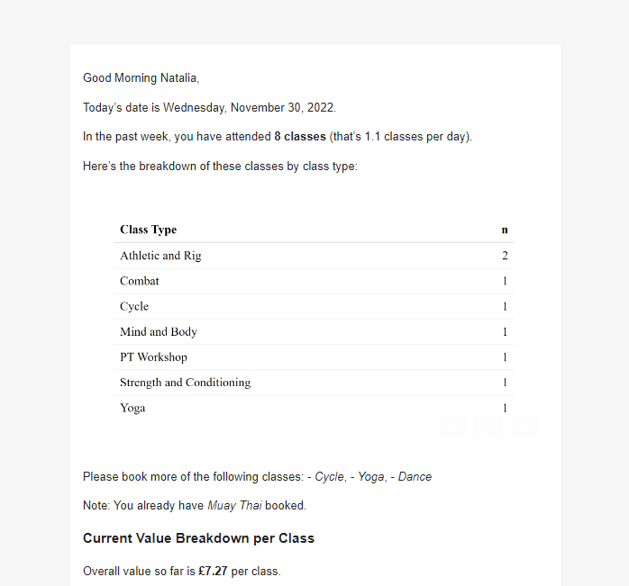

<!-- README.md is generated from README.Rmd. Please edit that file -->

```{r, include = FALSE}
knitr::opts_chunk$set(
  collapse = TRUE,
  comment = "#>"
)
```

# ThirdSpace

<!-- badges: start -->

<!-- badges: end -->

This is my personal, automated reporting to keep track of the classes I attend at my gym. I use it to motivate myself to undertake a larger variety of classes, extract a reasonable cost-value ratio from my membership, and keep track of other interesting stats and trends through pretty visualisations.

It uses the URL for a subscribed calendar to fetch the relevant information.

## Preview

Here's a snapshot of how the automated email report looks:



## Directory Structure

`email-report.Rmd` is the email report template.

`auto-email-report.R` is what the scheduler uses. This is where I set the email's recipients, subject, and other settings.

`schedule-email-report.R` is the code I ran once to set-up the automated scheduling. This is where I set the time and frequency of the email reports.

`ThirdSpace.Rmd` pertains to other reporting I might be interested in but want to be separate from my regular email reporting. It's a 'working' notebook.

`timetable-scrape.R` is how I scrapped the details for all possible class names and class types, so that I didn't have to create that information manually (note: that code is currently a little rough).

## Note

If you want to use this for your own ThirdSpace reporting, please note that I'm still working on making the code as generalisable as possible.

You would naturally need your own email credentials and calendar details, but some code lines are unique to me. For instance, I use IDs to remove classes that I didn't cancel beforehand and so they are "stuck" in my calendar data. I also have my personal class types attendance goals, and your cost-value calculation will vary based on how much your membership costs.

Lastly, the package {taskscheduleR} is Windows only; {cronR} is the equivalent for Mac.
